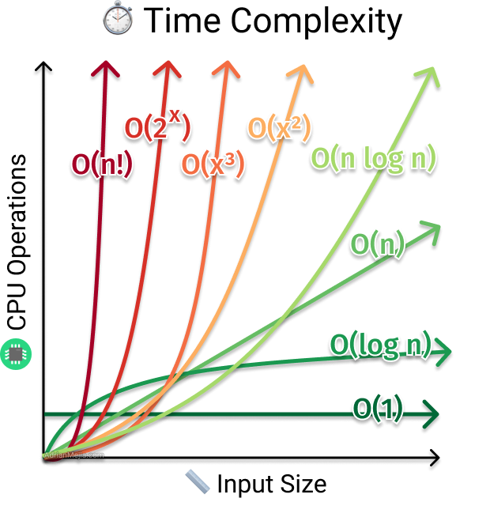

# 複雜度 (Complexity)

## 時間複雜度 (Time Complexity)

時間複雜度用來衡量演算法執行所需的時間，通常使用大 O 記號 (Big O Notation) 來表示。

### 常見的時間複雜度



- **O(1)** - 常數時間：不論輸入大小，執行時間固定
- **O(log n)** - 對數時間：如二分搜尋
- **O(n)** - 線性時間：需要遍歷所有元素一次
- **O(n log n)** - 線性對數時間：如合併排序、快速排序
- **O(n²)** - 平方時間：如冒泡排序、插入排序
- **O(2ⁿ)** - 指數時間：如遞迴計算費氏數列
- **O(n!)** - 階乘時間：如旅行推銷員問題的暴力解法

### 範例

```cpp
// O(1) - 常數時間
int getFirstElement(const vector<int>& arr) {
    return arr.empty() ? -1 : arr[0];
}

// O(n) - 線性時間
int findMax(const vector<int>& arr) {
    int maxVal = arr[0];
    for (int num : arr) {
        if (num > maxVal) {
            maxVal = num;
        }
    }
    return maxVal;
}

// O(n²) - 平方時間
void bubbleSort(vector<int>& arr) {
    int n = arr.size();
    for (int i = 0; i < n; i++) {
        for (int j = 0; j < n - i - 1; j++) {
            if (arr[j] > arr[j + 1]) {
                swap(arr[j], arr[j + 1]);
            }
        }
    }
}
```

## 空間複雜度 (Space Complexity)

空間複雜度用來衡量演算法執行過程中所需的額外記憶體空間。

### 範例

```cpp
// O(1) 空間複雜度 - 只使用固定的變數
int sumArray(const vector<int>& arr) {
    int total = 0;
    for (int num : arr) {
        total += num;
    }
    return total;
}

// O(n) 空間複雜度 - 需要額外的陣列
vector<int> copyArray(const vector<int>& arr) {
    vector<int> newArr;
    for (int num : arr) {
        newArr.push_back(num);
    }
    return newArr;
}
```

## LeetCode 練習題

以下是一些與複雜度分析相關的 LeetCode 題目：

1. [時間複雜度分析] - 分析不同演算法的效率
2. [空間優化] - 改進演算法以減少空間使用

## LeetCode 解題技巧：根據 Constraints 推測時間複雜度

在 LeetCode 中，每道題目都會給出 `Constraints`（限制條件），我們可以根據 `n` 的量級來推測**最優解的時間複雜度**，避免 TLE (Time Limit Exceeded)。

### 常見的 n 與時間複雜度對應表

| n 的範圍 | 建議的時間複雜度 | 可行的演算法 |
|---------|----------------|-------------|
| n ≤ 10 | O(n!) | 全排列、暴力搜尋 |
| n ≤ 20 | O(2ⁿ) | 狀態壓縮 DP、DFS + 剪枝 |
| n ≤ 100 | O(n³) | Floyd 演算法、三重迴圈 |
| n ≤ 1,000 | O(n²) | 雙重迴圈、DP |
| n ≤ 10,000 | O(n log n) | 排序、堆積、分治 |
| n ≤ 100,000 | O(n log n) | 快速排序、合併排序 |
| n ≤ 1,000,000 | O(n) | 單次遍歷、哈希表、雙指針 |
| n ≤ 10,000,000 | O(n) | 優化的線性演算法 |
| n > 10,000,000 | O(log n) 或 O(1) | 二分搜尋、數學公式 |

### 範例說明

```cpp
// 範例 1: Constraints: 1 <= n <= 10^5
// 建議使用 O(n) 或 O(n log n)
vector<int> twoSum(vector<int>& nums, int target) {
    unordered_map<int, int> map;  // O(n) 解法
    for (int i = 0; i < nums.size(); i++) {
        int complement = target - nums[i];
        if (map.count(complement)) {
            return {map[complement], i};
        }
        map[nums[i]] = i;
    }
    return {};
}

// 範例 2: Constraints: 1 <= n <= 1000
// 可以使用 O(n²) 解法
int maxProfit(vector<int>& prices) {
    int n = prices.size();
    int maxProfit = 0;
    // O(n²) 在 n <= 1000 時可以接受
    for (int i = 0; i < n; i++) {
        for (int j = i + 1; j < n; j++) {
            maxProfit = max(maxProfit, prices[j] - prices[i]);
        }
    }
    return maxProfit;
}
```

### 解題思路

1. **看到 Constraints，先評估時間複雜度**
   - `n <= 20` → 考慮暴力、回溯、狀態壓縮
   - `n <= 1000` → 考慮 O(n²) DP 或雙重迴圈
   - `n <= 10^5` → 必須 O(n log n) 或更優

2. **常見的優化方向**
   - 排序：O(n log n)
   - 哈希表：將 O(n²) 優化到 O(n)
   - 雙指針：將 O(n²) 優化到 O(n)
   - 二分搜尋：將 O(n) 優化到 O(log n)

3. **如果超時 (TLE)**
   - 檢查是否有不必要的重複計算
   - 考慮使用記憶化 (Memoization)
   - 嘗試更高效的資料結構

## 重點總結

- 時間複雜度關注執行時間的增長率
- 空間複雜度關注記憶體使用的增長率
- **根據 Constraints 推測最優時間複雜度，避免 TLE**
- 通常需要在時間和空間之間做出權衡
- 實際應用中，選擇合適的複雜度取決於問題的規模和限制