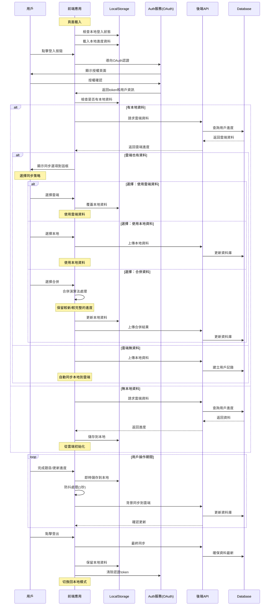

# 用戶登入與資料同步流程圖

## Sequence Diagram



## 關鍵設計要點

### 1. 雙向相容性
- **未登入狀態**：完全使用 LocalStorage，功能不受影響
- **登入後**：LocalStorage 作為快取層，雲端作為主要儲存

### 2. 衝突解決策略
```typescript
interface ConflictResolution {
  strategy: 'cloud' | 'local' | 'merge';
  mergeRule?: 'latest' | 'most-complete' | 'union';
}
```

### 3. 離線優先設計
- 本地優先寫入，確保即時響應
- 背景同步到雲端，使用防抖機制
- 網路恢復後自動重試失敗的同步

### 4. 資料結構建議
```typescript
interface ProgressData {
  userId?: string;
  lastSyncTime: Date;
  localVersion: number;
  cloudVersion?: number;
  problems: {
    id: string;
    completed: boolean;
    completedAt?: Date;
    notes?: string;
  }[];
}
```

### 5. 同步狀態指示
```typescript
enum SyncStatus {
  SYNCED = 'synced',
  SYNCING = 'syncing',
  PENDING = 'pending',
  CONFLICT = 'conflict',
  OFFLINE = 'offline'
}
```

## 實作建議

1. **漸進式增強**：先實作基礎功能，逐步加入進階特性
2. **版本控制**：為資料結構加入版本號，方便未來升級
3. **錯誤處理**：完善的重試機制和錯誤提示
4. **用戶體驗**：清晰的同步狀態顯示，避免資料丟失焦慮